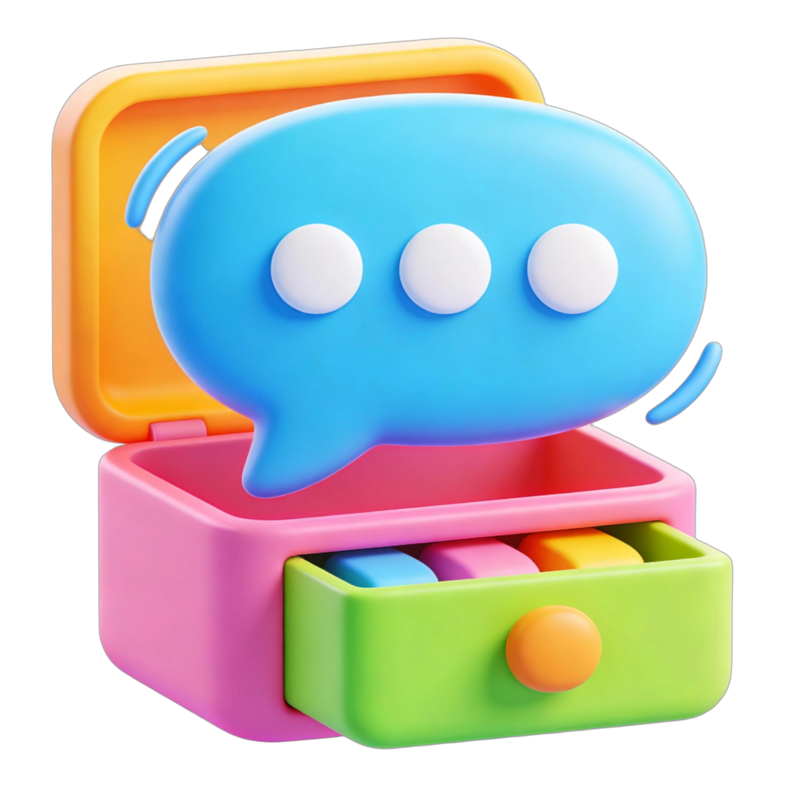
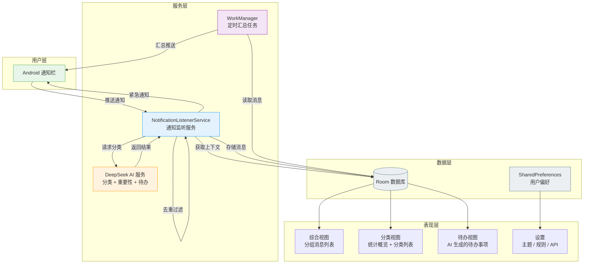
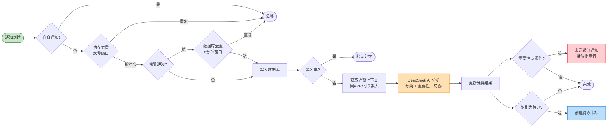
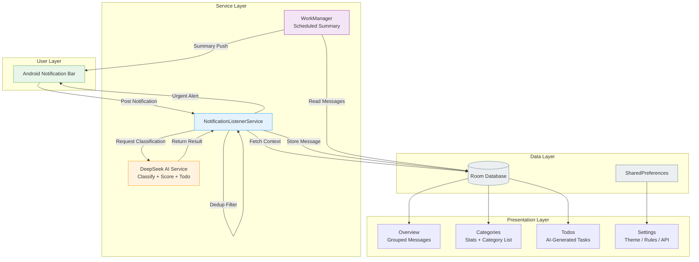

<div align="center">



# 🔔 SeeME

### AI-Powered Intelligent Notification Manager

**让每一条消息都被看见 · Every message matters · すべてのメッセージを見逃さない**

[](https://developer.android.com/)
[](https://developer.android.com/about/versions/oreo)
[](https://www.java.com/)
[](https://m3.material.io/)
[](https://www.deepseek.com/)
[](#license)

---

[简体中文](#简体中文) · [English](#english) · [日本語](#日本語)

</div>

---

<a id="简体中文"></a>

## 🇨🇳 简体中文

### 项目简介

SeeME 是一款基于 AI 大模型的 Android 智能通知管理应用。它能自动捕获手机上所有 APP 的通知消息，利用 DeepSeek AI 进行智能分类、重要性评估和待办事项提取，帮你从每天数百条通知中精准筛选出真正重要的信息。

不再被无用通知淹没，不再遗漏关键消息。

### 核心亮点

| 功能 | 说明 |
|:---:|:---|
| 🤖 **AI 智能分类** | 基于 DeepSeek 大模型，自动将消息归类为工作、生活、娱乐、广告推销等类别 |
| 📊 **重要性评估** | 每条消息自动评估 1-10 分重要性等级，高分消息优先展示 |
| 🔔 **紧急通知** | 重要消息独立推送，支持自定义阈值和音量，静音模式下也能送达 |
| 📝 **AI 待办提取** | 自动识别消息中的行动要求和时间约定，严格筛选后转为待办事项 |
| 🧠 **上下文理解** | AI 结合同一联系人/应用的近期消息历史进行综合判断 |
| 🎨 **全局主题** | 多套配色方案一键切换，背景、状态栏、导航栏全部联动 |
| 🔁 **智能去重** | 自动过滤音乐播放器等常驻通知的重复消息 |
| ⚙️ **深度定制** | 关键词规则、白名单/黑名单、自定义 AI 提示词 |

### 系统架构



### 消息处理流程



### 技术栈

| 模块 | 技术方案 | 版本 |
|:---:|:---:|:---:|
| 开发语言 | Java | 11 |
| UI 框架 | Material Design 3 | Latest |
| 本地存储 | Room | Latest |
| AI 引擎 | DeepSeek API | deepseek-chat |
| 后台调度 | WorkManager | Latest |
| 网络层 | OkHttp | Latest |
| 架构 | MVVM + LiveData | — |
| 最低版本 | Android 8.0 | API 26 |
| 目标版本 | Android 15 | API 35 |

### 快速开始

#### 1. 获取 DeepSeek API Key

本项目使用 [DeepSeek](https://www.deepseek.com/) 作为 AI 分类引擎，你需要自行注册并获取 API Key：

1. 前往 [DeepSeek 开放平台](https://platform.deepseek.com/) 注册账号
2. 在控制台创建 API Key
3. 安装应用后，进入 **设置 → API Key** 填入你的 Key

> **注意：** 本项目源码中不包含任何 API Key，你必须使用自己的 Key 才能启用 AI 分类功能。如果不填写 API Key，应用将使用本地关键词匹配进行基础分类。

#### 2. 构建项目

```bash
# 克隆仓库
git clone https://github.com/StellerSurgeCode/SeeME.git
cd SeeME

# 使用 Android Studio 打开项目，或使用命令行构建
./gradlew assembleDebug
```

#### 3. 签名配置（发布版本）

如需构建 Release 版本，请自行创建签名文件并配置环境变量：

```bash
export SEEME_STORE_PASSWORD=你的密钥库密码
export SEEME_KEY_PASSWORD=你的密钥密码
```

或在 `app/` 目录下创建 `seeme-release.jks` 签名文件，并修改 `app/build.gradle.kts` 中的签名配置。

#### 4. 权限设置

安装后需要授予以下权限才能正常工作：

| 权限 | 用途 |
|:---|:---|
| **通知监听权限** | 核心功能，读取和管理所有 APP 通知 |
| **忽略电池优化** | 确保后台服务持续运行不被系统杀死 |
| **通知发送权限** | 发送重要消息提醒和运行状态通知 |

### 项目结构

```
app/src/main/java/com/zjf/seeme/
├── data/                   # 数据层
│   ├── dao/                # Room DAO 接口
│   ├── entity/             # 数据库实体类
│   ├── AppDatabase.java    # Room 数据库
│   └── PrefsManager.java   # SharedPreferences 管理
├── service/                # 服务层
│   ├── NotificationListener.java   # 核心：通知监听服务
│   ├── DeepSeekService.java        # AI 分类服务
│   ├── KeepAliveService.java       # 服务保活
│   ├── WatchdogReceiver.java       # 定时看门狗
│   └── WorkScheduler.java          # 定时任务调度
├── ui/                     # 表现层
│   ├── adapter/            # RecyclerView 适配器
│   ├── fragment/           # Fragment（综合/分类/待办）
│   ├── MainActivity.java   # 主界面
│   └── SettingsActivity.java # 设置界面
└── util/                   # 工具类
    └── ThemeHelper.java    # 主题切换
```

---

<a id="english"></a>

## 🇺🇸 English

### About

SeeME is an AI-powered Android notification management app. It automatically captures all notifications from your phone, leverages the DeepSeek AI model for intelligent classification, importance scoring, and to-do extraction — helping you cut through notification noise and focus on what truly matters.

No more drowning in useless alerts. No more missing critical messages.

### Key Features

| Feature | Description |
|:---:|:---|
| 🤖 **AI Classification** | Powered by DeepSeek LLM — auto-categorizes messages into Work, Life, Entertainment, Ads, etc. |
| 📊 **Importance Scoring** | Each message scored 1–10; high-priority messages surface first |
| 🔔 **Urgent Alerts** | Critical messages trigger independent notifications with custom volume — even in silent mode |
| 📝 **AI To-Do Extraction** | Detects action items, deadlines, and appointments; strict filtering to avoid false positives |
| 🧠 **Context Awareness** | AI considers recent message history from the same contact/app for better judgment |
| 🎨 **Global Theming** | Multiple color schemes with full UI coverage — backgrounds, status bar, navigation bar |
| 🔁 **Smart Dedup** | Filters duplicate entries from persistent notifications (e.g., music players) |
| ⚙️ **Deep Customization** | Keyword rules, whitelist/blacklist, custom AI prompts |

### Architecture



### Tech Stack

| Module | Technology | Version |
|:---:|:---:|:---:|
| Language | Java | 11 |
| UI | Material Design 3 | Latest |
| Storage | Room | Latest |
| AI Engine | DeepSeek API | deepseek-chat |
| Background | WorkManager | Latest |
| Network | OkHttp | Latest |
| Architecture | MVVM + LiveData | — |
| Min SDK | Android 8.0 | API 26 |
| Target SDK | Android 15 | API 35 |

### Getting Started

#### 1. Get a DeepSeek API Key

This project uses [DeepSeek](https://www.deepseek.com/) as its AI classification engine. You need to obtain your own API Key:

1. Register at [DeepSeek Platform](https://platform.deepseek.com/)
2. Create an API Key in the dashboard
3. After installing the app, go to **Settings → API Key** and enter your key

> **Note:** The source code does NOT contain any API Key. You must provide your own key to enable AI classification. Without an API Key, the app falls back to local keyword-based classification.

#### 2. Build

```bash
git clone https://github.com/StellerSurgeCode/SeeME.git
cd SeeME
./gradlew assembleDebug
```

#### 3. Signing (Release Build)

To build a release version, create your own keystore and set environment variables:

```bash
export SEEME_STORE_PASSWORD=your_store_password
export SEEME_KEY_PASSWORD=your_key_password
```

#### 4. Required Permissions

| Permission | Purpose |
|:---|:---|
| **Notification Listener** | Core feature — read and manage all app notifications |
| **Ignore Battery Optimization** | Keep background service alive |
| **Post Notifications** | Send important message alerts and status notifications |

---

<a id="日本語"></a>

## 🇯🇵 日本語

### プロジェクト概要

SeeME は、AI 大規模言語モデルを活用した Android 向けスマート通知管理アプリです。スマートフォン上のすべてのアプリ通知を自動的にキャプチャし、DeepSeek AI によるインテリジェントな分類、重要度評価、ToDo 抽出を行い、毎日何百件もの通知の中から本当に重要な情報を正確にフィルタリングします。

不要な通知に埋もれることなく、重要なメッセージを見逃しません。

### 主な機能

| 機能 | 説明 |
|:---:|:---|
| 🤖 **AI スマート分類** | DeepSeek LLM ベース — 仕事、生活、エンタメ、広告などに自動分類 |
| 📊 **重要度評価** | 各メッセージを 1〜10 で自動スコアリング、高スコアを優先表示 |
| 🔔 **緊急通知** | 重要メッセージは独立通知で即時配信、カスタム音量対応、サイレントモードでも配信可能 |
| 📝 **AI ToDo 抽出** | アクション要求・期限・予定を自動検出、厳格なフィルタリングで誤検出を最小化 |
| 🧠 **コンテキスト理解** | 同一連絡先・アプリの最近のメッセージ履歴を考慮して総合判断 |
| 🎨 **グローバルテーマ** | 複数のカラースキーム — 背景、ステータスバー、ナビゲーションバーまで完全対応 |
| 🔁 **スマート重複排除** | 音楽プレーヤーなどの常駐通知の重複エントリを自動フィルタリング |
| ⚙️ **高度なカスタマイズ** | キーワードルール、ホワイトリスト/ブラックリスト、カスタム AI プロンプト |

### 技術スタック

| モジュール | 技術 | バージョン |
|:---:|:---:|:---:|
| 言語 | Java | 11 |
| UI | Material Design 3 | Latest |
| ストレージ | Room | Latest |
| AI エンジン | DeepSeek API | deepseek-chat |
| バックグラウンド | WorkManager | Latest |
| ネットワーク | OkHttp | Latest |
| アーキテクチャ | MVVM + LiveData | — |
| 最小 SDK | Android 8.0 | API 26 |
| ターゲット SDK | Android 15 | API 35 |

### クイックスタート

1. [DeepSeek プラットフォーム](https://platform.deepseek.com/) で API Key を取得
2. アプリインストール後、**設定 → API Key** に入力
3. 通知リスナー権限とバッテリー最適化の無視を許可

> **注意：** ソースコードに API Key は含まれていません。AI 分類機能を使用するには、ご自身の Key が必要です。

---

## 👨‍💻 Developer / 开发者 / 開発者

<table>
<tr>
<td align="center">
<a href="https://github.com/StellerSurgeCode">
<br />
<b>占俊凡 (StellerSurgeCode)</b>
</a>
<br />
<sub>Independent Developer</sub>
<br />
<a href="mailto:zjf20110511@qq.com">📧 zjf20110511@qq.com</a>
<br />
<a href="https://github.com/StellerSurgeCode">🔗 GitHub Profile</a>
</td>
</tr>
</table>

| | |
|:---|:---|
| **Version / 版本** | `2026.02.21` |
| **Package** | `com.zjf.seeme` |
| **GitHub** | [@StellerSurgeCode](https://github.com/StellerSurgeCode) |
| **Email** | zjf20110511@qq.com |

---

## 📦 Download / 下载 / ダウンロード

前往 [Releases](https://github.com/StellerSurgeCode/SeeME/releases) 页面下载最新 APK，安装即可直接使用，无需任何额外配置。

Go to the [Releases](https://github.com/StellerSurgeCode/SeeME/releases) page to download the latest APK. Install and use — no extra setup needed.

[Releases](https://github.com/StellerSurgeCode/SeeME/releases) ページから最新の APK をダウンロードしてください。インストールするだけですぐに使えます。

---

## 💡 About API Cost / 关于 API 费用 / API 費用について

> **中文：** Release APK 中已内置开发者个人的 API Key，下载安装后即可体验全部 AI 功能，无需自行申请。AI 分类所产生的 API 调用费用目前由开发者个人承担。如果你觉得这个项目对你有帮助、体验不错，欢迎在未来给予支持，但目前没有任何赞助要求，请放心使用。
>
> **English:** The release APK ships with the developer's own API Key — all AI features work out of the box after installation. The API costs are currently covered by the developer personally. If you find this project useful, feel free to show your support in the future, but there is absolutely no obligation or sponsorship requirement at this time. Enjoy!
>
> **日本語：** リリース APK には開発者個人の API Key が組み込まれており、インストール後すぐにすべての AI 機能をご利用いただけます。API の利用料金は現在、開発者が個人で負担しています。このプロジェクトが役に立ったと感じていただけたら、将来的にサポートいただけると嬉しいですが、現時点でスポンサーシップの要求はありません。安心してお使いください。

---

<a id="license"></a>

## 📜 License / 许可协议 / ライセンス

**Copyright &copy; 2026 占俊凡 (StellerSurgeCode). All Rights Reserved.**

This project is released under a **Proprietary License**. The source code is made available **for learning, technical exchange, and testing purposes only**.

本项目采用**专有许可协议**发布。源代码公开仅供**学习交流和功能测试**之用。

本プロジェクトは**プロプライエタリライセンス**の下で公開されています。ソースコードは**学習・技術交流・テスト目的のみ**で提供されます。

### Terms / 条款 / 条項

> **1. NO COMMERCIAL USE / 禁止商用 / 商用禁止**
>
> No individual or organization may use this software or any part of it for commercial purposes without prior written authorization from the developer. This includes but is not limited to selling, renting, distributing, embedding in commercial products, or providing commercial services.
>
> 未经开发者书面授权，任何个人或组织不得将本软件用于商业目的。
>
> 開発者の書面による許可なく、商業目的での使用は禁止されています。

> **2. NO REDISTRIBUTION / 禁止再分发 / 再配布禁止**
>
> Redistribution in any form (source code or compiled binaries) is prohibited without written authorization.
>
> 未经授权不得以任何形式重新分发。
>
> 書面による許可なく、いかなる形式での再配布も禁止されています。

> **3. NO DERIVATIVE WORKS / 禁止修改发布 / 派生作品禁止**
>
> Modified versions of this software may not be published or distributed in any form.
>
> 不得基于本软件修改后对外发布。
>
> 本ソフトウェアの改変版の公開・配布は禁止されています。

> **4. DISCLAIMER / 免责声明 / 免責事項**
>
> This software is provided "AS IS" without warranty of any kind. The developer assumes no liability for any damages arising from the use of this software.
>
> 本软件按「现状」提供，不附带任何保证。
>
> 本ソフトウェアは「現状のまま」提供され、いかなる保証も伴いません。

> **5. FINAL INTERPRETATION / 最终解释权 / 最終解釈権**
>
> The final interpretation of this license belongs to the developer (占俊凡).
>
> 本协议最终解释权归开发者所有。
>
> 本ライセンスの最終解釈権は開発者に帰属します。

📬 **For commercial licensing or business inquiries / 商业授权或合作洽谈 / 商用ライセンスに関するお問い合わせ:**

**zjf20110511@qq.com**

---

## 🙏 Acknowledgments / 致谢 / 謝辞

- [DeepSeek](https://www.deepseek.com/) — AI Classification Engine / AI 分类引擎 / AI 分類エンジン
- [Material Design 3](https://m3.material.io/) — UI Design System / UI 设计规范 / UI デザインシステム
- [Android Jetpack](https://developer.android.com/jetpack) — Core Component Library / 核心组件库 / コアコンポーネントライブラリ

---

<div align="center">

**Built with ❤️ by [StellerSurgeCode](https://github.com/StellerSurgeCode)**

</div>
